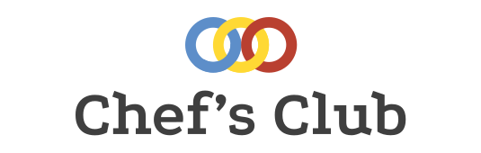

# Hey < /Geeks🧑‍💻 > 

<h2> Welcome to Chef's Club IIITR 💻</h2>

 

<h2>Chef's Club💻</h2>

###### Presents
## CP-Dictionary📔

 

<h3>Competitive Programming Dictionary👩‍💻 of IIITR</h3> 

This repo contains codes of various CP concepts, this repo is also a reference for other 
projects of House of Geeks.

If you want to learn algorithms and don't know where to start, check out [hg-store](https://github.com/houseofgeeks/hg_store/blob/master/Introduction%20to%20ACM%20ICPC%20Webinar%20(19th%20September%202020)/Resources.md)

## 📑Dictionary Structure
* [Array](https://github.com/houseofgeeks/CP-Dictionary/tree/master/Array)
* [Dynamic Programming](https://github.com/houseofgeeks/CP-Dictionary/tree/master/Dynamic%20Programming)
* [Graph](https://github.com/houseofgeeks/CP-Dictionary/tree/master/Graph)
* [Linked List](https://github.com/houseofgeeks/CP-Dictionary/tree/master/Linked%20List)
* [Number Theory](https://github.com/houseofgeeks/CP-Dictionary/tree/master/Number%20Theory)
* [Range-Query Algorithms](https://github.com/houseofgeeks/CP-Dictionary/tree/master/Range-Query%20Algorithms)
* [Sorting and Searching](https://github.com/houseofgeeks/CP-Dictionary/tree/master/Sorting%20and%20Searching)
* [Stack](https://github.com/houseofgeeks/CP-Dictionary/tree/master/Stack)
* [String](https://github.com/houseofgeeks/CP-Dictionary/tree/master/String)
* [Trees](https://github.com/houseofgeeks/CP-Dictionary/tree/master/Tree)
* [Tries](https://github.com/houseofgeeks/CP-Dictionary/tree/master/Tries)
* [Others](https://github.com/houseofgeeks/CP-Dictionary/tree/master/Other)

## 💫Languages
* C
* C++
* Python
* Java

## Contributions
Remember every champion🏆 was once a beginner🔰 
You can contribute by writing `code` , `improving README.md` file and many more. There are countless possibilities. 

🙋Remember [CONTRIBUTION GUIDELINES](https://github.com/houseofgeeks/CP-Dictionary/blob/master/CONTRIBUTING.md) should be followed strictly 

## Contributors ❤️ 

Made with [contributors-img](https://contributors-img.web.app).

## 📑Note
All the contributors who will follow the `Contributing Guidelines` to contribute will get successfully🏆 merged PR. Don't forget to follow us.

# Best of luck and happy coding!! 💻👍

